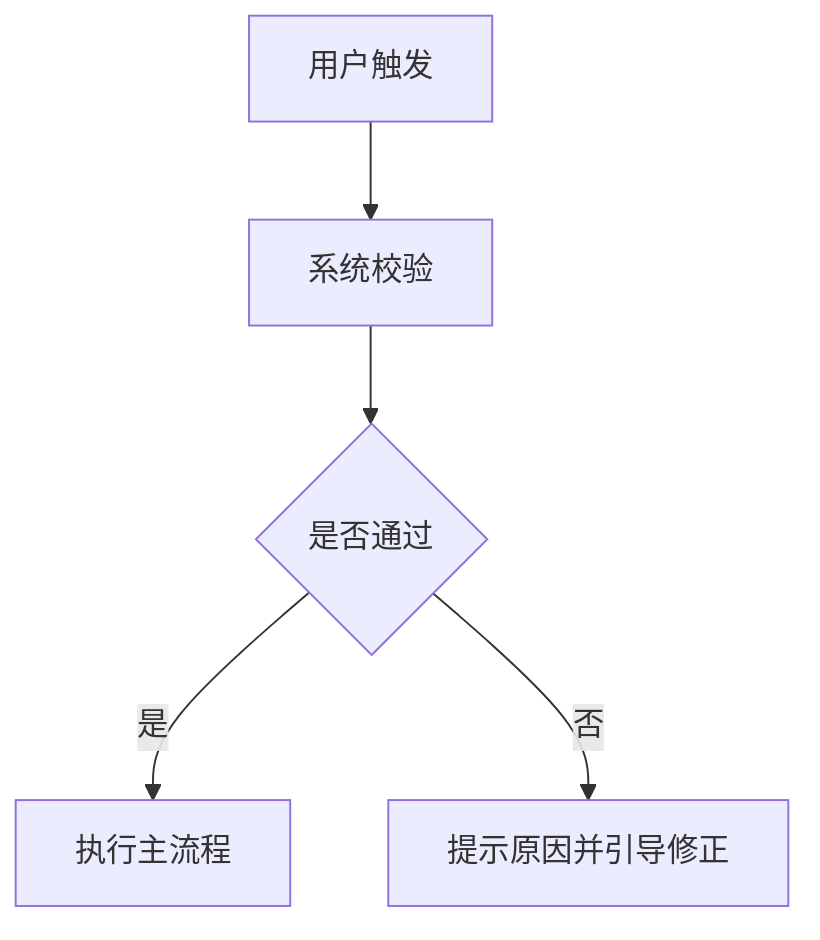

# PRD 产品需求文档模板

> 适用于功能迭代、新产品模块、后台系统和业务流程改造。
> 建议原则：先讲清楚问题和目标，再描述方案和规则。

## 1. 文档信息

| 字段 | 内容 |
| --- | --- |
| 产品/模块 |  |
| 需求名称 |  |
| 负责人 |  |
| 相关人员 | 产品 / 设计 / 前端 / 后端 / 测试 / 运营 / 销售 |
| 当前版本 | v0.1 |
| 创建日期 |  |
| 预计上线 |  |
| 状态 | 草稿 / 评审中 / 开发中 / 测试中 / 已上线 |

## 2. 背景与目标

### 背景

- 需求来源：
- 当前问题：
- 影响范围：
- 为什么现在要做：

### 目标

- 用户目标：
- 业务目标：
- 产品目标：

### 成功指标

| 指标 | 当前值 | 目标值 | 统计口径 | 观察周期 |
| --- | --- | --- | --- | --- |
|  |  |  |  |  |

## 3. 用户与场景

### 目标用户

- 角色：
- 使用频率：
- 权限范围：
- 核心诉求：

### 用户故事

```text
作为 [角色]，
我希望 [完成某个任务]，
以便 [获得某个结果]。
```

### 核心场景

| 场景 | 触发条件 | 用户动作 | 系统响应 | 期望结果 |
| --- | --- | --- | --- | --- |
|  |  |  |  |  |

## 4. 需求范围

### 本期做

-

### 本期不做

-

### 依赖与约束

- 技术依赖：
- 数据依赖：
- 业务依赖：
- 合规/安全约束：

## 5. 方案说明

### 信息架构

- 对象：
- 字段：
- 状态：
- 关系：
- 权限：

### 业务流程



### 页面与交互

| 页面/区域 | 说明 | 关键操作 | 异常状态 |
| --- | --- | --- | --- |
|  |  |  |  |

### 业务规则

| 编号 | 规则 | 示例 | 备注 |
| --- | --- | --- | --- |
| R1 |  |  |  |

### 权限规则

| 角色 | 查看 | 新增 | 编辑 | 删除 | 导出 | 审批 |
| --- | --- | --- | --- | --- | --- | --- |
| 管理员 |  |  |  |  |  |  |
| 普通用户 |  |  |  |  |  |  |

### 状态流转

| 当前状态 | 触发动作 | 下一个状态 | 操作人 | 通知对象 |
| --- | --- | --- | --- | --- |
|  |  |  |  |  |

## 6. 数据与埋点

### 数据字段

| 字段 | 类型 | 必填 | 默认值 | 说明 |
| --- | --- | --- | --- | --- |
|  |  |  |  |  |

### 埋点事件

| 事件名 | 触发时机 | 属性 | 用途 |
| --- | --- | --- | --- |
|  |  |  |  |

## 7. 异常与边界

- 网络异常：
- 权限不足：
- 数据为空：
- 重复提交：
- 并发冲突：
- 第三方服务失败：

## 8. 验收标准

| 编号 | 验收项 | 前置条件 | 操作步骤 | 预期结果 |
| --- | --- | --- | --- | --- |
| A1 |  |  |  |  |

## 9. 发布与回滚

- 灰度范围：
- 发布窗口：
- 回滚条件：
- 回滚方案：
- 上线后观察指标：

## 10. 版本记录

| 日期 | 版本 | 修改人 | 说明 |
| --- | --- | --- | --- |
|  | v0.1 |  | 初稿 |
